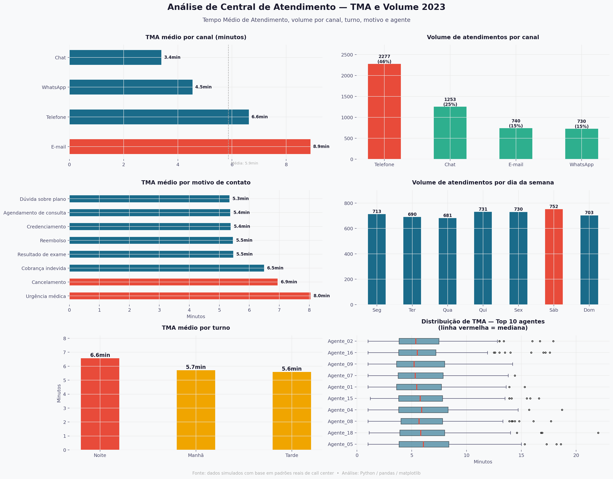

# 📞 Análise de Central de Atendimento — TMA e Volume 2023

Projeto de análise de dados com foco em tempo médio de atendimento (TMA) e volume
de chamadas em uma central de atendimento na área de saúde.
Desenvolvido como parte do meu portfólio de transição para Análise de Dados.

## 🎯 Objetivo
Identificar padrões de TMA e volume por canal, turno, motivo e agente, gerando
insights acionáveis para gestão de equipes de atendimento.

## 🔍 Perguntas respondidas
- Qual canal tem maior TMA — telefone, chat, e-mail ou WhatsApp?
- Em quais turnos o TMA é maior?
- Quais motivos de contato consomem mais tempo?
- Quais agentes estão acima da média de TMA?
- Em qual dia da semana o volume é maior?

## 💡 Principais insights
| Achado | Impacto |
|---|---|
| E-mail tem TMA 2,6x maior que Chat (8.9 vs 3.4 min) | Canal mais custoso da operação |
| Telefone representa 46% do volume total | Principal canal — maior oportunidade de otimização |
| Urgência médica tem o maior TMA (8.0 min) | Necessidade de fila prioritária |
| Turno da noite tem TMA 18% maior que a tarde | Subdimensionamento noturno |
| Sábado é o dia de maior volume (752 atendimentos) | Escala de fim de semana subestimada |

## 📊 Visualizações

## 🛠️ Ferramentas
- Python 3.12 · pandas · matplotlib · seaborn · Google Colab

## 👤 Sobre
Profissional em transição para Análise de Dados com background em atendimento
ao cliente no setor de saúde. Cursando Ciências de Dados na Estácio.
